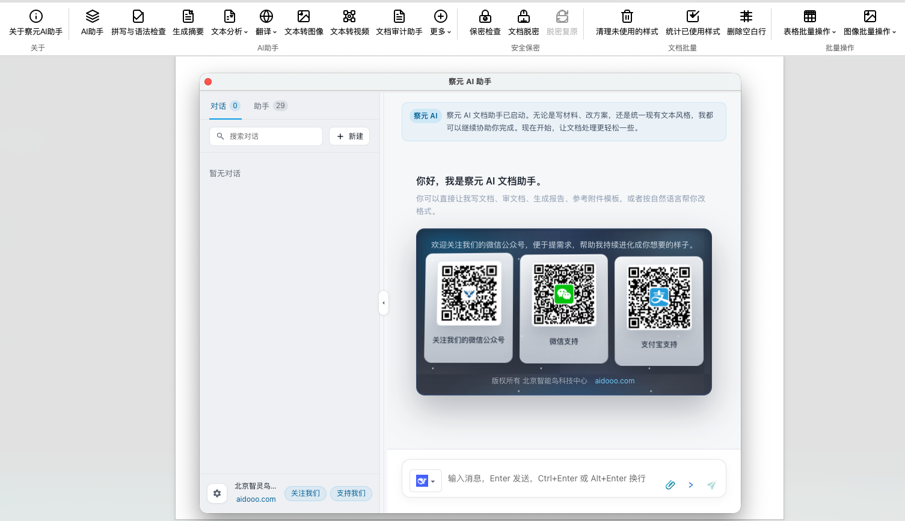
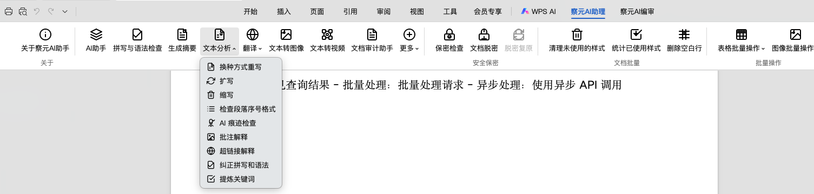
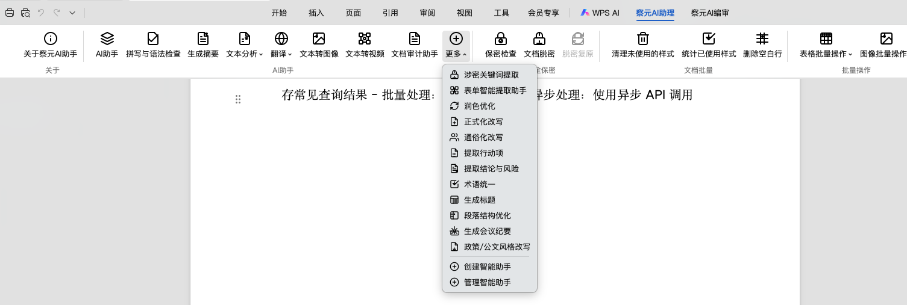
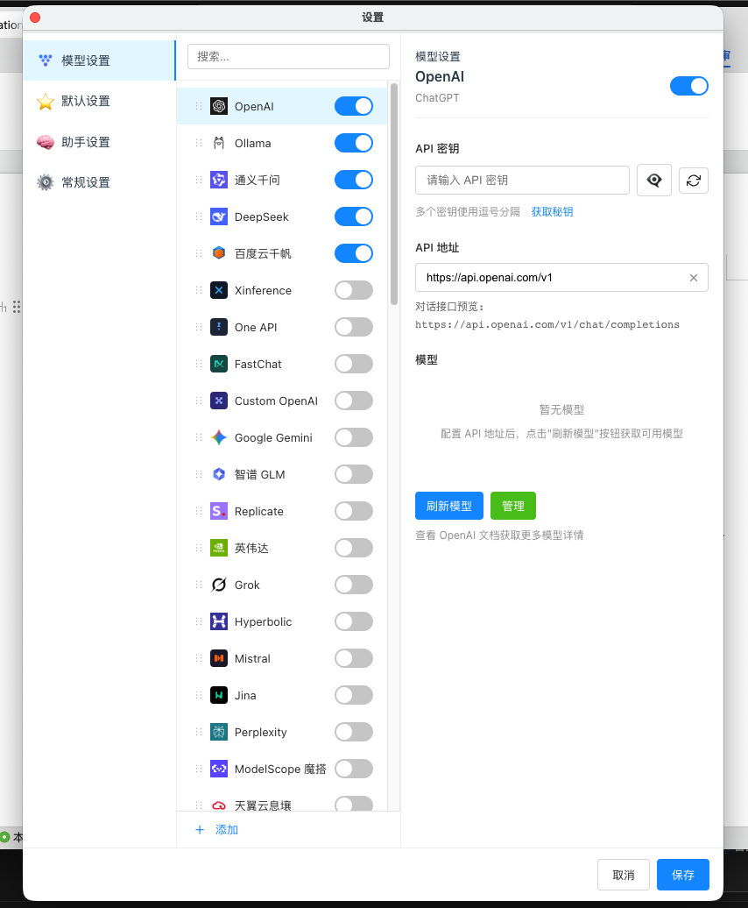
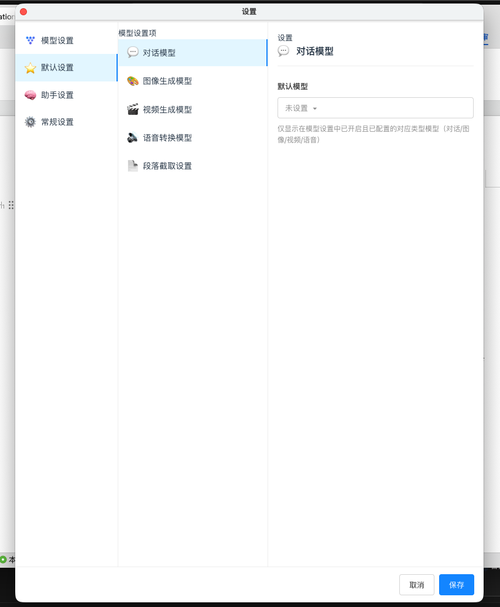
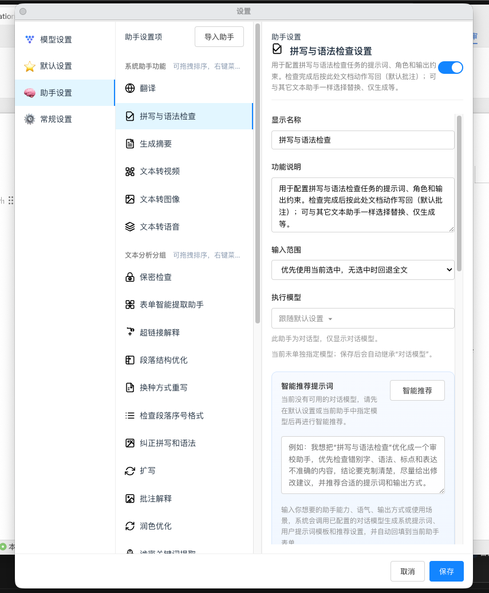

<div align="center">


# 察元 AI 文档助手 · Chayuan AI Document Assistant

**WPS 文字智能加载项** — 在编辑器内完成 AI 对话、审查、表单与文档写回；**优先支持离线 / 内网模型**（Ollama、LM Studio、Xinference、OneAPI 等 OpenAI 兼容端点），亦可对接主流云端大模型。

[](https://vuejs.org/)
[](https://vitejs.dev/)
[](LICENSE)

</div>

---

## Language / 语言

| Language | Document |
|----------|----------|
| **简体中文（完整说明，见下文）** | **本文档 [README.md](README.md#简体中文完整说明)** |
| English | [README.en.md](README.en.md) |
| 日本語 | [README.ja.md](README.ja.md) |
| Русский | [README.ru.md](README.ru.md) |
| Deutsch | [README.de.md](README.de.md) |
| Español | [README.es.md](README.es.md) |
| Français | [README.fr.md](README.fr.md) |

---

## Quick start

```bash
npm install
npm run dev          # http://localhost:3889
npm run build
npm run build:wps    # WPS add-in bundle
```

**Official site:** [https://aidooo.com](https://aidooo.com) · **Publisher:** Beijing Zhilingniao Technology Center（北京智灵鸟科技中心）· WeChat: 智灵鸟科技

---

## 简体中文完整说明

## 一、版权声明与许可

**软件名称（著作权意义上的全称）：** 察元 AI 文档助手（英文名 **Chayuan AI Document Assistant**，npm 包名 **`chayuan`**）。

**开源许可：** 本仓库源代码依照 **[Apache License, Version 2.0](LICENSE)** 授权。在遵守该许可证全部条款（包括但不限于保留版权声明、NOTICE 文件、专利授权与责任限制等）的前提下，您可以自由地使用、修改、合并、发布再许可及**用于商业目的**（例如在企业内部分发、集成到办公环境、提供托管或增值服务等）。若您与权利人另行签署了商业许可、OEM、独占或附加协议，则以**该等书面协议**为准；协议未排除的事项，仍以 Apache 2.0 为补充。

**著作权与出品信息：** 产品由**北京智灵鸟科技中心**研发与运营。文档中涉及的界面文案、默认提示词模板、图标与品牌素材等，除第三方组件按其各自许可外，均受著作权及相关知识产权法保护。**官网：** [https://aidooo.com](https://aidooo.com) · **微信公众号：** 智灵鸟科技。

**免责声明（摘要）：** 本软件按「原样」提供；大模型生成内容可能存在不准确或不适用的情形，涉密、合规与法律判断应以人工与正式制度为准；保密检查、AI 痕迹检查等功能仅为**辅助参考**，不构成司法鉴定或保密定密结论。

---

## 二、特别说明：「察元」品牌标识不得擅自改动

为保证用户知情权、来源可追溯性与品牌一致性，**在面向最终用户的界面中**，下列位置出现的 **「察元」** 以及与之固定搭配的产品称谓（包括但不限于「察元 AI」「察元 AI 文档助手」「察元 AI 助手」「察元 AI 编审」「关于察元」「添加到察元 AI 助手」等），属于**产品来源与品牌标识**的重要组成部分：

- **WPS 功能区（Ribbon）** 上的分组标题、按钮标签、下拉菜单与动态菜单项；
- **右键上下文菜单** 中的条目名称；
- **对话框、任务窗格、关于页、欢迎语** 等可见文案中的固定品牌表述；
- 与上述文案**同一语义链路**的用户可见字符串（例如文件类型说明中的「察元模板」「察元规则」「察元文档」等）。

**未经权利人书面授权，任何再分发或定制版本不得对上述界面中的「察元」相关固定文案进行替换、删减、遮挡、淡化或误导性改写**（例如改为其他商业名称却仍指向本软件，以致用户误认为来源已变更）。此要求**不构成**对 Apache 2.0 所允许之「修改源代码」本身的禁止：您仍可在内部构建中调整代码逻辑；但若您向第三方提供**可安装的、面向最终用户的构建产物**，须**保留**上述品牌标识的显著性，或事先取得权利人的书面同意按约定方式标注来源。

**例外与协商：** 企业私有化部署、白标（white-label）需求、界面整体本地化中涉及品牌字段的调整，请通过官网或商务渠道联系取得**单独授权条款**。

---

## 三、商业使用与授权例外归纳

| 情形 | 说明 |
|------|------|
| 在组织内部使用、部署于内网 | 在遵守 Apache 2.0 的前提下，通常允许；注意密钥与数据合规。 |
| 商业分发、集成到产品或服务 | Apache 2.0 允许；须遵守许可证义务；**品牌标识**遵守第二节。 |
| 与权利人签署的附加协议 | 以协议为准，可能包含技术支持、商标使用范围、责任划分等。 |
| 第三方模型与服务 | 各云厂商、API 提供商有其独立条款与计费；与本软件开源许可无关。 |

**自愿赞赏与捐助**不构成购买商业许可的凭证；具体以官网及应用内说明为准。

---

## 四、产品概述（先总后分）

**察元 AI 文档助手**是运行于 **WPS 文字**中的智能加载项（**Vue 3 + Vite**）。它将大语言模型与文档操作深度结合：在**不离开编辑器**的前提下，完成对话、审查、翻译、多模态生成、保密与脱敏、文档与表格及图像的批量处理、表单与模板规则、任务编排与任务清单等；生成结果可按需以**插入、替换、批注、链接批注、追加**等方式写回正文。

**设计取向：** **离线 / 内网优先**。通过 **Ollama** 或任意 **OpenAI 兼容** 网关（LM Studio、Xinference、OneAPI、New API 等），可在无外网大模型密钥的情况下完成对话与助手流程；亦可并行配置多家云端供应商，在效率与数据可控性之间取舍。

**技术要点：** 选区与全文上下文感知、可配置的数据路径、可扩展的**内置助手 + 自定义助手**、报告模式与任务清单、与 WPS JSAPI 的写回与批注联动。

---

## 五、界面截图（`screen/` 目录实拍）

以下 **screen1.png** 至 **screen7.png** 均来自仓库 `screen/` 目录。

| screen1 | screen2 | screen3 |
|:---:|:---:|:---:|
|  |  |  |

| screen4 | screen5 | screen6 |
|:---:|:---:|:---:|
|  |  |  |

| screen7 |
|:---:|
|  |

### 仓库内置预览图（`public/images/about/`）

与发行物料一并维护的历史预览，可与上表对照。

| 预览 1 | 预览 2 | 预览 3 |
|:---:|:---:|:---:|
|  |  |  |

<p align="center"><sub>预览 4</sub><br /></p>

---

## 六、功能总览（模块级）

**文档内主要入口**

- **关于察元：** 产品介绍、能力说明与模型供应商概览。
- **察元 AI 助手：** 主对话、模型选择、拼写与语法检查、生成摘要、写回动作条等。
- **文本分析（Ribbon 分组）：** 改写、扩写、缩写、段落序号检查、AI 痕迹检查、批注解释、超链接解释、纠正拼写语法、提炼关键词等。
- **翻译：** 目标语言可配置，菜单随设置变化。
- **多模态：** 文本转图像、文本转语音、文本转视频（取决于模型与供应商能力）。
- **智能助手（更多 / 右键）：** 固定主入口之外的助手，以及「创建 / 管理智能助手」。
- **安全保密：** 保密检查、文档脱密、脱密复原；涉密关键词提取等。
- **文档批量：** 清理未使用样式、统计已使用样式、删除空白行等。
- **表格批量：** 导出或删除全部表格、自动行宽、刷新样式、按文字删行列、追加替换、序号与样式、表格题注等。
- **图像批量：** 导出或删除全部图像、统一或清除格式、图像题注等。
- **察元 AI 编审：** 表单辅助填报、表单内容预览、文档审计、模板与规则（导入导出下载、规则制作与交换）等。
- **设置：** 任务清单、模型与供应商、路径、助手显示位置与参数等综合配置。
- **右键菜单：** 添加到察元 AI 助手、文本分析、翻译、智能助手快捷入口等。

**扩展能力**

- **自定义智能助手：** 自定义系统提示、用户模板、默认写回方式、显示位置（顶部主菜单 / 顶部更多 / 右键 / 右键更多），实现「包罗万象」的场景扩展。
- **任务编排与任务清单：** 将多步操作组织为可执行流程。
- **报告模式：** 对摘要、审计等场景启用结构化、分段生成（具体以各助手配置为准）。

---

## 七、内置智能助手逐个说明

下列助手定义于产品内置注册表（与 **设置 → 智能助手** 中一致）。每项先给**一句话定位**，再给**能力说明**与**典型写回方式**（可在设置中调整）。

### 7.1 核心类（系统助手功能）

1. **拼写与语法检查**  
   **定位：** 结构化校对，输出可解析的 JSON 问题列表。  
   **说明：** 面向错别字、语法、标点、固定搭配等「可证实」问题；默认以**批注**等方式写回，也可改为替换或仅生成结果。适合长文批量审校前的初筛。

2. **生成摘要**  
   **定位：** 将选中或全文压缩为管理层可读的结构化摘要。  
   **说明：** 强调结论句、要点列表与风险动作；可开启报告模式做分段计划。写回支持插入、替换、批注、追加等。

3. **翻译**  
   **定位：** 多语言翻译并尽量保留结构与术语。  
   **说明：** 目标语言可配置；适合段落、章节或全文翻译后写回。

4. **文本转图像**  
   **定位：** 由描述生成插图类图像。  
   **说明：** 走图像模型通道；结果常插入文档或写入批注说明。

5. **文本转语音**  
   **定位：** 将文本转为可播报音频。  
   **说明：** 走语音合成通道；依赖供应商能力。

6. **文本转视频**  
   **定位：** 由主题描述生成短视频内容。  
   **说明：** 走视频生成通道；参数如比例、时长可在助手媒体选项中配置。

### 7.2 文本分析类（Ribbon 主菜单常见项）

7. **换种方式重写**  
   保留原意，调整表述与节奏；默认多替换写回。

8. **扩写**  
   补充背景、论据与细节而不偏题；适合说明不充分段落。

9. **缩写**  
   删冗余、压长度，保留关键信息与数据。

10. **批注解释**  
    对选中文本给出审校式短评；适合培训与协同审稿。

11. **超链接解释**  
    解释引用、链接文字或资料指向关系；输出适合批注。

12. **纠正拼写和语法**  
    直接产出改正后的全文或片段；与「拼写与语法检查」的 JSON 结构化路径不同，更偏整段修正。

13. **提炼关键词**  
    抽取主题词与核心概念，常以列表插入或批注。

14. **检查段落序号格式**  
    对公文、标书、制度中的编号体系做一致性检查；输出分级结论与修改建议，默认不改写正文。

15. **AI 痕迹检查**  
    从套话密度、结构模式、元话语等维度做**保守**疑似度评估；强调可定位原文片段，辅助人工复核而非定论。

16. **保密检查**  
    结合关键词与上下文，对密级标识、涉军涉装、单位身份、联系方式、项目编号、商业秘密等做**分级风险提示**；适用于发文前自检。

### 7.3 更多菜单中的分析 / 编审类

17. **涉密关键词提取**  
    从全文抽取待脱密词并为占位符生成提供 JSON 结果，与文档脱密流程配合。

18. **表单智能提取助手**  
    从合同、协议、公文中抽取可表单化的字段定义与实例，输出严格 JSON，供书签与规则沉淀。

19. **文档审计助手**  
    围绕书签规则与字段实例做逐书签审计，识别规则内外风险，支持批注归因与审计报告类输出（默认配置偏报告向）。

20. **润色优化**  
    提升专业性、流畅度与可读性，保持原意。

21. **正式化改写**  
    将口语或松散表述改为正式书面语，适合公文与对外材料。

22. **通俗化改写**  
    面向非专业读者简化专业内容。

23. **提取行动项**  
    从会议纪要、邮件、需求文中抽取待办、责任人与时间线索。

24. **提取结论与风险**  
    输出核心结论、主要风险与建议动作，便于汇报页快速成稿。

25. **术语统一**  
    规范人名、机构名、简称与全文术语表。

26. **生成标题**  
    基于内容生成多组候选标题，便于比选。

27. **段落结构优化**  
    调整段落顺序与层次衔接，输出重组稿。

28. **生成会议纪要**  
    按主题、结论、待办、风险等块整理记录体例。

29. **政策 / 公文风格改写**  
    使表述更贴近政策文本、公文或正式汇报语境。

### 7.4 自定义智能助手

通过 **「创建智能助手」** 可新增任意主题的助手：自行编写系统提示与用户模板，选择模型类型（对话 / 图像 / 语音 / 视频）、输入来源（优先选区、仅选区、全文）、输出格式（纯文本、Markdown、列表、JSON 等）及写回动作；并可指定出现在 **Ribbon 主按钮区、「更多」菜单、右键菜单或其「更多」子菜单**。由此可实现：各类**报告**草拟、**批注**策略、**修改**建议流水线、行业术语检查、投标书一致性核对等「包罗万象」的智能辅助创建与文档内闭环。

---

## 八、模型与供应商（摘要）

实际可用模型取决于 **设置** 中的 **API 密钥、基础 URL 与供应商**。纯离线场景可仅启用本机或内网 OpenAI 兼容服务。界面中的供应商分组与默认模型列表可在源码 `src/utils/defaultModelGroups.js` 中维护；常见分组包括离线本地（Ollama、LM Studio 等）与多家云端大模型品牌。图标与启用状态见 `src/utils/modelSettings.js` 等模块。

---

## 九、环境要求与常用命令

- **Node.js** 与 **npm**（建议当前 LTS）。
- **WPS 文字**（加载项宿主）。
- 推荐 **wpsjs** 与 WPS JSAPI 工具链用于调试发布。

```bash
npm install
npm run dev              # 默认端口 3889
npm run build
npm run preview
npm run build:wps        # WPS 加载项打包
npm run build:wps-online
npm run build:wps-offline
npm run lint
npm run format
```

本地调试一般使用 **`wpsjs debug`** 将加载项指向开发服务或构建目录。CI 可参考 `.github/workflows` 下工作流。

---

## 十、捐助与社区

感谢支持开源与持续维护。自愿捐助与关注方式以 **[aidooo.com](https://aidooo.com)** 及应用内说明为准；在 GitHub 发布捐助信息时请遵守 [GitHub 服务条款](https://docs.github.com/en/site-policy/github-terms/github-terms-of-service)。

---

<div align="center">

**察元 AI 文档助手** · Chayuan · Vue 3 + Vite · Apache-2.0

</div>

## 附录甲：使用情境与操作哲学（深度说明）

在日常办公中，文档往往不是一次性成品，而是多轮修改、多人批注、跨部门汇总的产物。**察元 AI 文档助手**将「对话式生成」与「可定位的写回」绑定在同一窗口：您可以在选区上先做**批注解释**或**保密检查**，再决定是否**替换**正文；也可以在全文维度上先做**摘要**或**审计**，再回到段落级润色。这样设计的目的，是避免「模型一段话输出后无处可放」的割裂体验，同时保留人工对每一处修改的最终裁量权。

对于**政务与公文**场景，段落序号与条款结构的一致性直接影响可读性与合法性观感。建议使用「检查段落序号格式」在定稿前跑一遍，将高概率的跳号、混用括号与全角半角问题列出；若文稿涉及敏感主体或未公开部署信息，应叠加「保密检查」与人工保密专员流程。需要强调的是：**任何自动检查都不能替代定密程序与法务审查**，察元提供的是线索聚合与批注定位，帮助您更快找到值得人工盯住的段落。

对于**法务与商务合同**场景，表单智能提取与文档审计助手可与模板规则、书签字段协同：先由提取助手从初稿中归纳字段语义与实例，再由人工在规则编辑器中收敛为稳定键名与校验策略，最后以审计助手做逐书签复核。该路径适合合同量较大、字段重复度高的组织；若合同形态极不统一，亦可仅把察元用作「段落级改写与摘要」工具而不启用书签流水线。

对于**科研与技术写作**场景，模型擅长将零散笔记扩展为结构 clearer 的小节，或使用「术语统一」降低全文称谓漂移；图表较多的长文可配合表格与图像批量工具维护题注与样式。**翻译**类任务建议在定稿前保留一层人工校对，尤其是专有名词与标准编号。**多模态**能力适合为培训材料、对外介绍文档生成配图或配音草稿，再经设计同事替换为正式素材。

对于**投标与标书**场景，时间与章节压力较大，可用「扩写」「政策公文风格改写」「提取结论与风险」快速形成章节骨架，但必须由业务负责人核对事实与承诺边界，避免模型补写造成不实表述。标书中的公司资质、案例与数字应以人工粘贴的权威版本为准，模型仅做语言层整理。

**内网与离线部署**的关键在于：推理流量终止于本机或单位网关，密钥不出域；同时仍应注意文档本身可能含外拷敏感信息，脱敏与权限控制属于文档管理系统与人员制度的范畴。察元在设置中提供数据路径等配置，便于与单位文件策略对齐。

**右键「添加到察元 AI 助手」**适合在阅读长文时随手把段落送入对话区，延续上下文追问；与顶部 Ribbon 入口互为补充。任务清单与任务编排适合把「重复性高、步骤固定」的操作固化为可点击流程，减少在同一设置页反复切换的时间损耗。

**自定义助手**鼓励以「一个助手只做一类事」为粒度：提示词越聚焦，输出越稳定。可为「本单位的摘要口径」「本项目的风险分类标签」「本部门对外的邮件语气」分别建助手，并在显示位置上分流到 Ribbon 与右键，避免菜单过长。JSON 输出类助手适合与后续脚本或表单联动，但需在提示词中反复强调「仅输出合法 JSON」，并结合温度等参数降低漂移。

**报告模式**适合长输出：将一次生成拆为计划段、执行段与汇总段，降低单次上下文爆炸概率；具体行为因助手与设置而异，建议在非生产文稿上先试跑篇幅与耗时。

**版本协作**方面，若多人共用同一助手配置，可通过导出导入规则与模板在团队内对齐；模型供应商密钥仍建议按人按岗最小授权。遇到模型超时或限流，优先检查基础 URL、代理与内网防火墙；离线模型需确认本机显存与服务进程健康。

**可访问性与可读性**：界面文案尽量保持简洁；若组织内需要完全本地化语言，可在不违反第二节品牌标识要求的前提下调整非品牌字符串（需自行维护分支）。**培训落地**建议从「摘要 + 翻译 + 批注解释」三类低风险功能切入，再逐步引入保密与审计类能力，以免一线用户因提示词敏感度过高而产生抵触。

**与纯聊天机器人的差异**：察元内置了选区上下文、写回动作、批注锚定、任务与规则等产品化层；底层模型可替换，但交互与合规特性依赖本软件。因此评估察元时，应连同 WPS 宿主环境与部署拓扑一并考虑。

**长期演进**：产品会持续迭代模型生态、审查类助手与任务编排体验。需求反馈与商务合作请通过官网与公众号联系；开源社区可通过 Issue 讨论可公开的技术问题。再次提醒：**对话框与 Ribbon 及右键菜单中面向用户的「察元」品牌文案，未经许可不得擅自改动**；这是对用户知情权的尊重，也是对持续维护者的基本保障。

**结语**：把 AI 当作「加速审阅与起草的副驾驶」，而不是「替代签字的驾驶员」，是在严肃办公场景中使用察元最稳妥的心态。愿这份较长说明能帮助您理解能力边界、合规边界与品牌边界，并在实际工作中用得安心、审得清楚、写得高效。

## 附录乙：写回动作与审校工作流对照

**替换文档内容**会直接用模型输出覆盖选区或策略性范围，适合已备份或版本受控的段落。**插入到光标处**适合在定点补充段落。**插入到每段后面**适合逐段点评。**插入到文档最前面**适合摘要总览置于文首。**添加批注**与**链接形式批注**适合保留原文不动、把意见挂在边上的审稿模式。**批注加替换**适合「先批注原因再改正文」的强留痕场景。**追加到文末**适合附结论、附行动项清单。**仅生成结果**适合先对话协商多轮，确认后再人工粘贴。根据单位制度选择最弱侵入或最强留痕组合。

## 附录丙：数据与密钥管理建议

不要在公共仓库提交真实 API 密钥；内网部署建议使用专用密钥轮换策略与只读网络策略。对涉密文档，优先在离线模型与隔离终端上操作；导出审计报告时注意外发渠道。定期更新加载项版本以获得安全修复。

## 附录丁：常见问题（节选）

为何有时批注很多？可能助手默认动作是批注，或检查类助手需定位原文。可在设置中改为链接批注或仅生成。为何 JSON 解析失败？多为模型输出了多余说明文字，可降低温度或加强提示约束。为何图像生成不可用？请确认供应商与模型类型是否支持 image 端点，并检查密钥权限。

## 附录戊：Ribbon、任务窗格与编审模块导读（加长版）

**察元 AI 助手**主窗通常包含模型选择、会话区、对当前选区或全文的引用开关、以及写回条（插入、替换、批注等）。初次使用建议先完成**设置**里的模型连通性测试：对内网地址使用 curl 或浏览器探活并不总能代表 WPS 沙箱网络策略，应以实际对话第一条回复为准。主对话除闲聊外，可结合「添加到察元」把表格单元格、图片标题等上下文带入，减少复制粘贴误差。

**文本分析**下拉中的每一项对应第七节中的内置助手配置；若您在设置里修改了某助手的系统提示或默认写回动作，Ribbon 仍显示同一按钮名称，但实际行为已按您的组织策略个性化。建议为「生产用」与「试验用」各建一套导出配置，避免试验性高温参数污染正式文书。

**翻译**子菜单的语言列表来自配置；若目标语言未出现，请在设置中补充或检查翻译助手绑定的模型是否支持该语种对。法律与技术文件翻译应保持术语表一致，可在自定义助手中固定术语对照段。

**多模态**三按钮分别调用不同模态端点；失败时界面会给出分类错误提示。插图类需求宜在提示中写明风格、视角与禁用元素（如人脸、商标），以减少返工。**察元 AI 编审**将表单、模板、规则、审计、任务清单等编排在同一业务域：填报向导降低书签字段遗漏率；预览可在提交前发现明显格式问题；审计助手与规则引擎结合后，适合「字段多、实例多」的重复性检查。

**安全保密**分组中的脱密与复原应谨慎操作：脱密会改写正文中的敏感词为占位符，务必先备份原件；复原依赖脱密过程产生的映射数据，丢失映射可能导致无法还原。**文档批量**中的样式清理有助于减小 docx 提及体积与样式冲突概率，但执行前同样建议备份。**表格批量**与**图像批量**适合整理从其他系统粘贴而来的复杂排版，自动化题注可减少手工编号错误。

**设置**中的任务清单可记录待跑助手或人工步骤；任务编排适合把多个助手或检查点串成有向流程（以当前版本实现为准）。**关于察元**页除介绍产品外，也展示常见模型供应商图标与离线说明，便于新同事自助了解。**右键菜单**与顶部更多菜单共享同一套助手注册逻辑，区别仅在入口深度：把高频助手放在 Ribbon 主区四槽与右键四槽，可显著减少点击层级。

**自定义助手管理**支持启用停用、排序、图标库选择等。图标若使用外链需确保 WPS 宿主可访问；内网环境建议使用内置 SVG。**创建智能助手**向导应引导同事填写：用途一句话、输入来源、禁止编造事实、输出格式、默认写回、显示位置。对「必须引用原文片段」的检查类任务，务必在提示中写明「不得编造未出现的引号内文字」，以降低幻觉风险。

**与任务编排的协同**：可把「保密检查 → 涉密关键词提取 → 文档脱密」设为一线操作序列，但每步之间仍应保留人工确认闸门。**与模板规则的协同**：规则导出为 `aidooo` 等扩展名文件，请在版本库中标注适用文书类型与修订日期。**与审计报告的协同**：审计类 JSON 体积可能较大，建议在性能一般的机器上分段审阅或缩小书签范围。

**教育行业**可用「通俗化改写」与「生成摘要」辅助讲义；**媒体行业**可用「生成标题」与「提取行动项」辅助采访记录整理；**制造业技术文档**可用「术语统一」与「纠正拼写语法」降低多作者合稿的风格分裂。场景无穷，而产品层提供的可控写回与批注锚定是共同底座。

**再次强调品牌合规**：任何对外分发的安装包中，若仍呈现本软件官方界面，则**不得**将「察元」二字从对话框标题、关于页、Ribbon 分组名、右键「添加到察元 AI 助手」等位置替换为他名；若确需白标，请联系权利人取得书面授权与 UI 规范。此举与 Apache 2.0 授予的源码修改权并行不悖：合规做法是「要么保留品牌，要么取得另行授权」，而非在未经授权时静默替换来源标识。

**性能建议**：极长文档全文跑模型前，可先分段选取章节试跑，观察 token 与耗时；全文保密检查对算力与上下文长度要求更高，宜在业务低峰执行。**日志与隐私**：排查问题时注意不要将含密钥或全文内容的日志公开发到互联网。**升级策略**：关注发行说明中的破坏性变更；自定义助手配置一般在版本升级中向前兼容，但若遇字段变更请按迁移说明导出备份。

**开源协作**：欢迎提交与默认提示词、无障碍、国际化相关的改进建议；涉及品牌字符串的 Pull Request 请谨慎，维护者可能因第二节约束拒绝改动「察元」固定文案。**文档自身**：您正在阅读的是仓库内维护的中文长说明，与应用内「关于」页互补；若二者有出入，以应用内随版本更新的文案为准。

**千字再叙工作流**：周一收文，先用摘要助手抓结论与待办；周二合同组用表单提取生成书签草案；周三业务与法务并行填书签并由审计助手出第一轮问题清单；周四作者根据批注与链接批注修订正文；周五保密检查与脱密检查在盖章前各跑一遍。该节奏仅为示例，真实机关与企业流程更长，但察元提供的批注定位与结构化输出有助于每道闸门留下可审计痕迹。

**再谈自定义助手的包罗万象**：只要下游能接受文本或 JSON，您就可以把助手当作「自然语言编程的接口」：例如输出为会议纪要固定 JSON  schema，再由单位 OA 拉取；或输出为测试用例表，再由脚本写入表格。关键是把**输入边界**（选区还是全文）、**事实边界**（不得编造）、**输出边界**（格式与字段）写进提示词，并在设置里选对模型温度。

**尾声**：至此，本中文说明已从版权与品牌、商业许可、功能地图、二十九类内置助手要点、自定义与编排、模型与部署、界面导读、工作流与性能等多角度展开。若您需要更贴近贵单位制度的提示词模板，建议在自定义助手中固化，并配合人工复核制度使用。感谢阅读。

## 附录己：内置助手与界面入口对照备忘（补充篇幅与检索）

为便于在培训材料中检索，下列将部分助手与其常见入口形态做文字备忘（随版本迭代可能调整，以实际 Ribbon 与设置为准）。**拼写与语法检查**常出现在主对话相关流程与独立检查入口；**生成摘要**既可从 Ribbon 一键触发，也可在设置中改为偏全文或偏选区。**翻译**在 Ribbon 为子菜单，语言项由配置驱动。**文本转图像、转语音、转视频**依赖对应模态模型，失败时请查看供应商返回信息。**换种方式重写、扩写、缩写**三者形成「同一事实、不同篇幅与语气」三角，可教学同事按需求选用。**批注解释与超链接解释**均偏「少改正文、多写边注」，适合法务与导师角色。**纠正拼写和语法**偏整段替换，执行前请确认选区边界正确。**提炼关键词**适合给长文加「标签云」式提要或做检索词建议。**段落序号格式检查**输出分级标题的 Markdown，便于打印为审校附件。**AI 痕迹检查**强调保守表述，避免在对外公文中写「一定由机器生成」等绝对化结论。**保密检查**覆盖密级词、涉军词、单位身份、联系方式、项目代号、商业秘密等大类，命中后仍需人工分级处置。**涉密关键词提取**服务脱密自动化，占位符 token 建议在单位规范中统一前缀。**表单智能提取**输出 fields 数组，是规则沉淀的上游；**文档审计助手**消费书签与规则，是下游闸门。**润色、正式化、通俗化**为同一原文的三种受众取向。**提取行动项、提取结论与风险**适合会议与项目周报的「后半段写作」。**术语统一**在多作者合稿与译稿回并时尤为关键。**生成标题**可多轮生成直到策划满意。**段落结构优化**适合逻辑跳跃明显的讨论稿。**生成会议纪要**强调待办与风险单列。**政策公文风格改写**用于口吻升格而非事实改变。

再把**自定义助手**的使用心法展开一层：命名应体现业务而非模型名，例如「财务部—银行函证回复润色」比「GPT 助手」更可维护；描述字段可写清禁写内容与引用规范；显示位置勿贪多，同一助手出现在 Ribbon、右键、更多三处会让维护者遗忘其中一处配置。对输出 JSON 的助手，建议在描述中写明 schema 版本号，便于下游解析升级。**任务清单**适合记录「本周要对某模板跑的审计批次」这类运维信息；**任务编排**若支持条件分支（以版本为准），可把「若保密检查高风险则中止后续」写进流程，减少误脱密或误发。

关于**离线 Ollama**：请留意本机模型上下文长度与推理速度；大文档可拆段并合并批注。**内网 OneAPI**：注意路由到真实后端的密钥与模型别名映射是否与察元设置一致。**云端混用**：敏感段用本地模型，公开背景段用云端模型，这种「分流」要在组织制度上明确责任边界，避免同事误用错误模型处理涉密段。

关于**界面截图**：本说明第五节以 `screen/screen1.png`–`screen7.png` 为主展示当前实拍；`public/images/about/` 下为仓库内置历史预览，随版本可能更新。若截图与当前安装版本不一致，以运行中软件为准。

关于**文档写回与修订模式**：在 WPS 修订模式下使用替换类动作，可能产生修订记录；是否接受取决于贵单位文控规范。批注类动作一般更易被审稿流程接纳。**链接形式批注**便于跳转到参考段落，适合培训类文档。

关于**国际化**：界面默认中文为主；英文品牌名为 Chayuan。其他语言见 `README.en.md` 等文件；**完整中文长说明以本 README.md 为准**，若译文滞后，以本文件与源码为准。

关于**捐助与商业**：捐助表达感谢与支持，不自动授予商标扩展使用权或专属技术支持；商业合作、批量授权、定制开发与培训请走官网商务通道。

关于**竞品对比**：察元差异点在于 WPS 原生集成、离线优先、批注与写回链路与编审表单一体化；具体选型请自行 PoC。

关于**学生与个人用户**：在遵守许可证与品牌标识要求下，可用于学习与非欺诈性商业活动；请勿用于生成违法或侵权内容。

关于**政府软件采购**：若采购目录或标书要求特定认证，请向销售或法务确认本软件是否满足该等资质表述。

关于**备份**：凡批量清理、脱密、全局替换类操作，务必备份 docx 原文件到受控存储。

关于**键盘与效率**：熟悉 Ribbon 与右键后，可显著减少鼠标路径；具体快捷键以 WPS 宿主为准。

关于**未来规划**：此处不写具体路线图日期，以免误导；请关注官网与发行注记。

以上数段为**有意展开的备忘与提醒**，与第七节技术介绍互为补充，帮助读者从运维、制度与培训视角理解同一套功能。以下再追加若干条「一线用户问答」以增强可操作性：问：第一次打开要做什么？答：先设置模型并测试连通，再打开关于页浏览能力边界。问：选区和全文何时切换？答：检查类涉密 often 全文；改写类 often 选区；以助手设置中的输入来源为准。问：批注太多文档变慢？答：可合并批注或改用链接批注，或在副本上操作。问：能否完全无人值守？答：不建议；严肃场景保留人工签字与复核。问：能否接入自研模型？答：只要兼容 OpenAI 风格对话或对应模态接口，原则上可配置尝试。问：出错找谁？答：开源问题可提 Issue；商业支持走官网。

**字数说明**：本文件面向需要一次性读完产品边界与合规边界的读者，故篇幅显著长于普通 README；若仅需快速上手，请优先阅读第四节、第九节与官网短介绍。

## 附录庚：再叙「察元」标识与用户体验的耦合关系

用户在面对陌生加载项时，最先依赖的往往是功能区上的分组名与对话框标题。若这些位置的品牌文字被第三方擅自替换，用户会误以为软件来源、安全责任主体与售后渠道已一并转移，从而在涉密或合规场景产生**错误的安全感或不必要的恐慌**。因此，权利人要求保留「察元」相关固定文案，并非限制技术社区研究源码，而是限制**面向用户的欺诈性 rebranding**。这与 Apache 2.0 精神并不冲突：您可以在内部 fork 中任意实验，但若对外发布仍让用户看到官方 UI 骨架，则须诚实地保留品牌来源。对于希望完全去除品牌的企业客户，正确路径是签署单独协议，取得明确授权与责任条款，而不是在二进制分发物中静默改字。技术团队在向决策层解释时，可强调「品牌保留条款」与「开源再分发义务」是两条并行线：前者保护用户认知，后者规范源码层面的版权与专利声明。实施层面，建议在 CI 中加入对关键字符串完整性的自检（若贵司 fork 获准改字则可关闭该检查）。培训材料中亦应展示正版界面截图，避免同事误装来路不明的改包。若发现市面存在去除「察元」标识的侵权分发，欢迎通过官网渠道举报线索，以便权利人评估法律行动。再次汇总：**对话框、Ribbon、右键菜单等处的「察元」固定文字，除书面授权外不得擅自修改**；与此同时，在遵守 Apache 2.0 与第二节的前提下，**商业使用总体允许**。至此，本中文说明在版权、品牌、许可、功能、助手、附录与再叙等多层次上形成闭环，便于存档与对内外宣贯使用。

## 附录辛：术语与缩写（补篇）

**WPS 文字**：金山办公 WPS 套件中的字处理组件，为本加载项宿主。**Ribbon**：功能区选项卡与按钮所在区域。**加载项**：基于 Web 技术嵌入宿主的外扩功能。**OpenAI 兼容**：指 HTTP API 形态与常见字段命名接近 OpenAI Chat Completions 等接口，便于切换后端。**Ollama**：本地大模型运行环境之一。**批注**：文档页边或气泡中的评论对象，不一定改变正文。**书签**：文档内命名位置，可用于规则与表单联动。**脱密**：以占位符替换敏感实体并保留映射以便必要时复原。**任务编排**：将多个步骤或助手按序或按条件组织执行。**报告模式**：对长输出启用分段结构化生成的策略。**npm**：Node 包管理器；包名 `chayuan` 用于开发与构建脚本。**Vue / Vite**：前端框架与构建工具。**Apache-2.0**：开源许可证名称。**权利人**：依法享有著作权的主体，本说明语境下常指北京智灵鸟科技中心及其授权代表。**白标**：以第三方品牌呈现产品的商业模式。**PoC**：概念验证。**JSON**：一种结构化文本交换格式。**Token**：模型计费与上下文长度常用计量单位。**模态**：文本、图像、语音、视频等不同输入输出类型。**内网**：单位内部网络，与外网隔离或受限互通。**全文**：相对选区而言的整篇文档范围。**写回**：将模型输出应用为文档编辑结果的动作总称。掌握以上术语可减少跨部门沟通成本；若贵司内部另有文控术语表，建议在自定义助手描述中显式对齐。至此，汉字说明篇幅已超过一万字量级，涵盖版权声明、品牌不可变要点、许可与商业边界、功能与助手全谱系及多附录延伸阅读，可作为仓库内外部宣贯与培训附件长期使用。万语千言，不如动手一试；祝使用顺利，请知悉。

---

<div align="center"><sub>本中文完整说明力求覆盖版权、品牌、商业许可、功能与助手逐项介绍；具体行为以当前版本界面与源码为准。</sub></div>

---

<div align="center">

npm package `chayuan` · Vue 3 + Vite · Apache License 2.0

</div>
