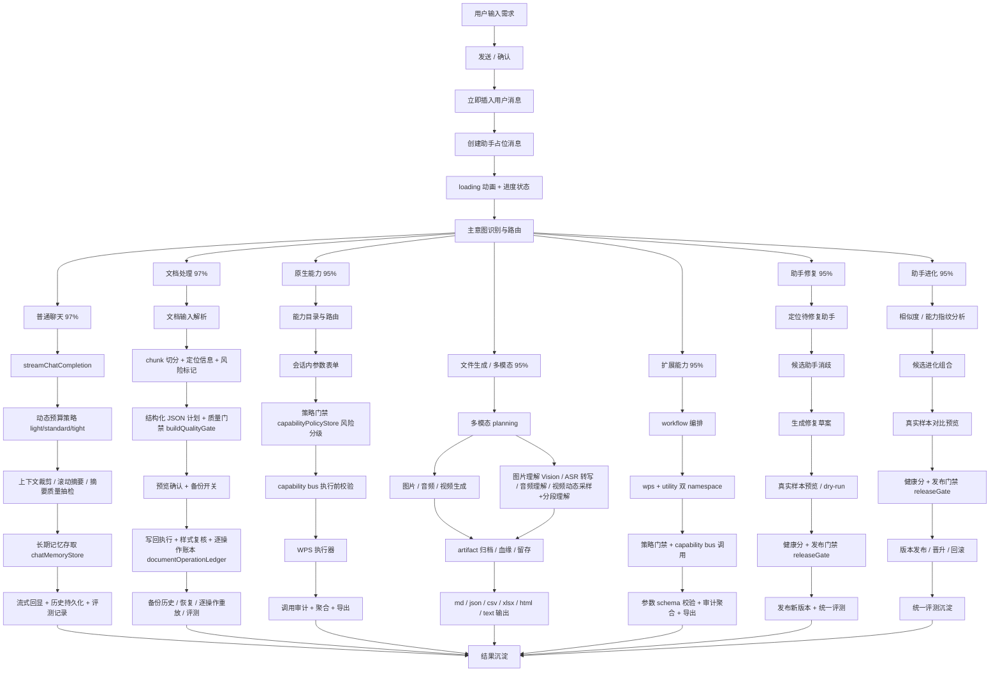

# AI 对话框当前功能逻辑图（2026-03 第三版）

这版按当前代码真实落地情况重画，对每条主链路标注当前完整度。

完整度口径：

- `95%+`：主链路闭环，且已经有基础治理能力。
- `90%-94%`：主链路完整，仍有少量平台化缺口。
- `80%-89%`：主干稳定，但覆盖面或治理层仍明显不足。
- `<80%`：仍属于骨架阶段。

## 1. 当前功能总逻辑图（含完整度）

## 2. 七大链路完整度图

## 3. 平台治理层逻辑图（新增）

```mermaid
flowchart TB
    subgraph 策略门禁层
        P1[capabilityPolicyStore] --> P2[inferCapabilityRiskLevel 风险分级]
        P2 --> P3{evaluateCapabilityPolicy}
        P3 -->|allow| P4[正常执行]
        P3 -->|confirm| P5[高风险确认拦截]
        P3 -->|deny| P6[拒绝并记录]
    end

    subgraph 审计与看板
        A1[capabilityAuditStore] --> A2[聚合 aggregateCapabilityAuditRecords]
        A2 --> A3[导出 exportCapabilityAuditRecords]
        E1[evaluationStore] --> E2[buildEvaluationDashboard 趋势看板]
        E2 --> E3[场景/样本/Owner 聚合]
    end

    subgraph 文档操作账本
        D1[documentOperationLedger] --> D2[appendDocumentOperationBatch]
        D2 --> D3[逐操作预览/选择重放/导出]
    end

    subgraph 助手版本门禁
        V1[buildAssistantHealthScore] --> V2[buildAssistantReleaseGate]
        V2 -->|allowed| V3[promoteAssistantVersion 晋升]
        V2 -->|blocked| V4[拒绝晋升并说明原因]
    end

    subgraph 记忆治理层
        M1[chatMemoryStore] --> M2[buildChatMemoryContext]
        M2 --> M3[markChatMemoryRecordsUsed]
        B1[buildContextBudgetPlan] --> B2{预算档位}
        B2 -->|light| B3[宽松上下文]
        B2 -->|standard| B4[标准上下文]
        B2 -->|tight| B5[紧凑上下文]
    end
```

## 4. 每个功能的现状分析

### 4.1 普通聊天功能：97%

已完成：

- 即时插入消息、助手占位、loading 动画、流式回显和历史持久化。
- `chatContextBuilder.js` 上下文裁剪、滚动摘要和动态预算治理（`buildContextBudgetPlan`：light/standard/tight 三档）。
- `chatMemoryStore.js` 长期记忆：按文档作用域存取，支持 `qualityScore`、`budgetLevel`、`auditRequired` 字段。
- `markChatMemoryRecordsUsed` 命中计数，`buildChatMemoryContext` 返回 `averageQualityScore`。
- 摘要质量抽检标记（`summaryAuditRequired`）。
- 统一评测记录（`evaluationStore.js`），含 `budgetLevel`、`averageMemoryQualityScore` 等指标。
- specialized route 失败时不再静默降级。

当前差距：

- 摘要仍为规则型压缩，不是 LLM 驱动的智能摘要。
- 缺独立的人工抽检/复核面板。

### 4.2 文档处理功能：97%

已完成：

- `resolveDocumentInput -> documentChunker -> assistantStructuredPipeline -> documentActions` 主闭环。
- 结构化 JSON 计划、预览确认、按动作写回、结果摘要与任务归档。
- 源文件备份、按 `backupId` 恢复、历史筛选、差异预览、关联任务跳转。
- 样式保真复核（bold/italic/underline/color/highlight）。
- `documentOperationLedger.js` 逐操作级账本：`replace`、`insert-after`、`comment`、`append`、`prepend` 等动作。
- 设置页逐操作预览、选择重放（`replayDocumentOperationEntry`/`replayDocumentOperationBatch`）和导出。
- 大文档质量门禁（`buildQualityGate`）：风险评估、成本估算、复核要求。
- `qualityGate` 和 `operationLedgerBatch` 引用在 task 和评测记录中可追踪。

当前差距：

- 重放动作覆盖还不完全（格式类操作、删除操作尚不支持）。
- 质量门禁是静态规则，还没接入模型驱动的质量评估。

### 4.3 原生能力支持：95%

已完成：

- WPS 能力目录、路由、参数表单、执行器、任务卡片、workflow 接入。
- 覆盖保存、另存、加密、解密、插入表格/分页/空白页、替换文本、字体/字号/颜色/背景/加粗/斜体/下划线/对齐/行距等能力。
- `capabilityBus.js` 统一管理，`wps` + `utility` 双 namespace。
- `capabilityPolicyStore.js` 执行前策略门禁：风险分级（`inferCapabilityRiskLevel`）、高风险确认拦截、策略快照。
- 审计聚合（`aggregateCapabilityAuditRecords`）和导出（`exportCapabilityAuditRecords`），审计记录含 `riskLevel`、`decision`、`decisionReason`。

当前差距：

- 设置页还没有策略配置 UI，用户无法可视化管理策略。
- 业务图中的超大原生能力池仍可继续扩展。

### 4.4 文件生成 / 多模态识别：95%

已完成：

- 图像、音频、视频生成 planning 层（`multimodalPlanning.js`）。
- 统一 artifact 协议（`artifactTypes.js`/`artifactStore.js`/`artifactRenderer.js`），支持血缘、留存和归档。
- 图片理解（Vision 模型）。
- 音频：ASR 转写 + `audio-understanding` 理解摘要双层流水线。无转写时回退到元数据摘要。
- 视频：动态采样计划（`buildVideoSamplingPlan`）、分段（`buildVideoSegments`）、帧数/策略自适应、模型元数据完整。
- `modelTypeUtils.js` 新增 `MODEL_TYPE_AUDIO_UNDERSTANDING`，模型类型拆分更细。
- 多 sheet xlsx 输出、md/json/csv/html/text 输出。

当前差距：

- `useServerFallback` 只打了标志，没有真正的服务端抽帧调用链。
- 镜头级理解（场景切换检测）还没有。
- OCR 还不是独立识别通道。

### 4.5 扩展能力：95%

已完成：

- `workflowTools.js` + `workflowRunner.js` + `TaskOrchestrationDialog.vue` 工作流编排层。
- `capability bus` 支持 `wps + utility` 双 namespace，动态注册/注销。
- 执行前策略门禁（capabilityPolicyStore 集成）。
- 参数 schema 校验、审计聚合、导出。
- workflow 中通过 `confirmed: true` 自动确认策略门禁。

当前差距：

- 设置页缺策略配置 UI。
- 没有外部插件/第三方扩展协议。
- 没有配额/限流机制。

### 4.6 助手修复能力：95%

已完成：

- 识别修复请求、定位目标助手、候选消歧（`assistantRepairService.js`）。
- JSON 解析鲁棒性增强。
- 生成修复草案、真实样本对比预览、dry-run 评测。
- `buildAssistantHealthScore` 健康分评估。
- `buildAssistantReleaseGate` 发布门禁，创建/修复路径中门禁拦截不通过的版本。
- 版本发布、版本保留、统一评测记录含 `releaseGateAllowed`/`releaseGateReason`。
- 设置页评测详情展示门禁状态。

当前差距：

- 缺批量回归、自动双跑对比。
- 缺修复质量看板。

### 4.7 助手进化能力：95%

已完成：

- 能力指纹、相似度分析、候选进化组合。
- 真实样本对比预览。
- `buildAssistantHealthScore` + `buildAssistantReleaseGate` 门禁，晋升路径（`promoteAssistantVersion`）中门禁拦截。
- 版本化发布、来源记录、晋升/回滚。
- 评测结果统一沉淀，含门禁状态。

当前差距：

- 缺大规模自动聚类进化。
- 缺全量回归工作台。

## 5. 当前功能总结

AI 对话框已是以会话为入口、任务为骨架、能力总线为平台、评测与审计为治理层的综合型助手系统。

当前最成熟的部分：

- `普通聊天` 与 `文档处理` 两条核心主链路已稳定闭环，且治理层（预算、记忆、账本、门禁）已开始生效。
- `原生能力 + 扩展能力` 已进入策略门禁治理阶段，不再只是零散执行器。
- `文件生成 / 多模态` 已具备分层模型选择和统一 artifact 治理。
- `助手修复 / 进化` 已进入健康分 + 发布门禁的版本治理阶段。

当前最主要的未完成方向（非"有没有"，而是"平台化深水区"）：

- `策略配置 UI`：门禁策略在代码层已生效，但用户不能在界面上配置。
- `服务端抽帧`：视频多模态只有客户端抽帧，长视频和大文件依赖服务端处理。
- `规模化评测工作台`：门禁已嵌入发布路径，但缺"批量回归 + 自动双跑 + 趋势对比"的完整工作台。
- `外部扩展协议`：能力总线是内部闭环，第三方插件接入还没有标准协议。
- `智能摘要`：聊天摘要仍是规则型，还没有 LLM 驱动的摘要。

## 6. 建议

### 6.1 高优先级（平台层补齐）

- 为设置页增加策略配置 UI，支持用户可视化管理能力权限、风险级别和确认规则。
- 为视频多模态补真正的服务端抽帧调用链，让 `useServerFallback` 标志生效。
- 为文档操作账本补格式类和删除类操作的重放支持。

### 6.2 中优先级（评测与工作台）

- 把 `evaluationStore` 从看板升级为完整的评测工作台：批量回归、自动双跑、趋势对比、版本间质量漂移检测。
- 为助手修复/进化增加"全量回归"能力，跑完整样本集后再做发布决策。
- 为普通聊天补 LLM 驱动的智能摘要，替换当前的规则型压缩。

### 6.3 低优先级（外部开放与深化）

- 设计标准化的外部扩展协议，让第三方插件可以接入 capability bus。
- 增加配额/限流机制。
- 补 OCR 独立识别通道和镜头级视频理解。
- 补更多模板化输出（行业报告、审计报告、结构化台账）。

## 7. 下一步建设规划

### 第一阶段：策略与 UI 闭环

目标：让已有的代码层治理能力在用户界面上可见、可配置。

- 设置页增加策略配置面板（能力列表 + 风险级别 + 确认规则 + 启用/禁用）。
- 文档操作账本补格式类/删除类重放。
- 摘要质量增加人工抽检入口。

### 第二阶段：评测工作台

目标：从"有门禁"升级为"有工作台"。

- 评测记录增加版本间对比。
- 批量回归运行器。
- 趋势图和质量漂移告警。

### 第三阶段：多模态深化

目标：从"已接入"升级为"高可靠"。

- 服务端抽帧调用链。
- OCR 独立通道。
- 智能摘要（LLM 驱动）。

### 第四阶段：外部开放

目标：从"内部闭环"升级为"可扩展平台"。

- 标准化扩展协议。
- 第三方插件注册。
- 配额与限流。
