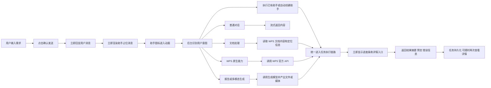

# AI 智能助手对话框处理逻辑汇报版

这版只保留产品视角最关键的一条链路，适合汇报、演示、截图或放到方案文档首页。

## 一图看懂主流程

## 汇报时可以这样解释

1. 用户点击确认后，前端先把用户消息和助手占位消息立刻渲染出来，所以界面不会卡住。
2. 助手图标会先进入动画，表示系统已经开始处理，而不是等模型或网络返回后才更新界面。
3. 后台会先识别这是普通聊天、文档处理、WPS 操作、报告生成，还是助手任务。
4. 如果是文档处理，会先读取 WPS 原生内容和定位信息，再结合结构化 JSON 结果生成执行计划。
5. 所有长任务都会统一进入任务链路，展示进度、详情、停止、结果预览，并把结果持久化下来。

## 一句话版

`用户输入 -> 立即回显 -> 动画反馈 -> 智能路由 -> WPS/模型执行 -> 结果回填 -> 任务留痕可追溯`
