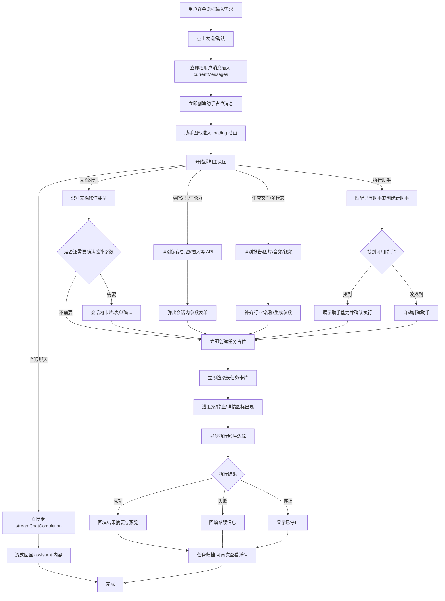
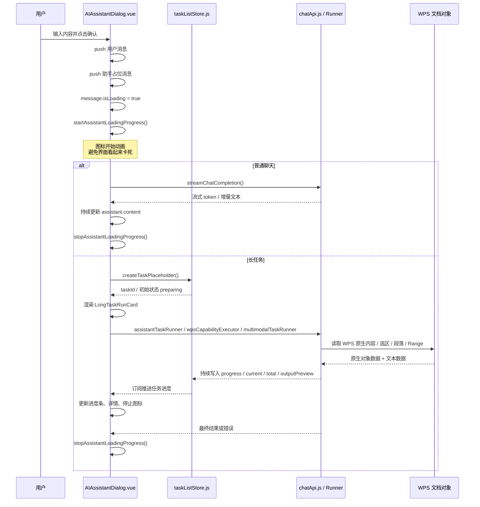

# AI 智能助手对话框处理逻辑图

这版重画为“主流程 + 时序 + 底层实现 + 数据返回”四层，重点从 `用户输入` 开始，沿着 `点击确认 -> 立即回显到对话框 -> 图标动画 -> 意图识别 -> WPS/模型执行 -> 返回结果` 一路往下看。

## 1. 主流程图



## 2. 对话框即时回显时序图



## 3. 底层实现链路图

```mermaid
flowchart LR
    A[用户确认发送] --> B[`AIAssistantDialog.vue`]
    B --> C[立即插入用户消息]
    B --> D[立即插入助手占位消息]
    B --> E[`startAssistantLoadingProgress()`]

    B --> F[主意图识别]
    F -->|chat| G[`streamChatCompletion()`]
    F -->|document-operation / assistant-task| H[`assistantTaskRunner.js`]
    F -->|wps-capability| I[`wpsCapabilityExecutor.js`]
    F -->|generated-output| J[`multimodalTaskRunner.js`]

    H --> K[`resolveDocumentInput()`]
    K --> K1[WPS 原生输入]
    K1 --> K2[Selection]
    K1 --> K3[Range]
    K1 --> K4[Paragraphs / Content]
    K --> L[归一化文本输入]

    L --> M[`documentChunker.js`]
    M --> N[chunk 切分]
    N --> O[paragraphRefs]
    N --> P[relativeRangeMap]
    N --> Q[riskProfile]

    M --> R[`assistantStructuredPipeline.js`]
    R --> S[`chatCompletion()`]
    S --> R
    R --> T[解析结构化 JSON]
    T --> U[quality 评估]
    U --> V[operation arbitration]
    V --> W[executionPlan]

    W --> X[`applyStructuredExecutionPlan()`]
    X --> Y[`documentActions.js`]
    Y --> Y1[replace]
    Y --> Y2[comment]
    Y --> Y3[insert-after]
    Y --> Y4[comment-replace]
    Y --> Z1[写回 WPS 文档]

    H --> Z2[`taskListStore.js`]
    I --> Z2
    J --> Z2
    Z2 --> Z3[`LongTaskRunCard.vue`]
    Z2 --> Z4[`Popup.vue`]
    Z2 --> Z5[`TaskProgressDialog.vue`]
```

## 4. WPS 原生数据 和 结构化 JSON 是怎么衔接的

### 4.1 WPS 侧原生数据

文档处理不是只把一整段纯文本丢给模型，而是同时保留 WPS 原生定位信息，再构造成可给模型理解的结构化上下文。

典型来源包括：

- `Selection`：当前选区
- `Range`：起止位置范围
- `Paragraphs`：段落集合
- `doc.Content`：全文范围
- `Text`：原始文本

内部会被整理成类似这样的对象：

```json
{
  "sourceMode": "selection-preferred",
  "hasMeaningfulSelection": false,
  "resolvedScope": "document",
  "text": "第一段\\n第二段\\n第三段",
  "start": 0,
  "end": 1280,
  "paragraphs": [
    {
      "index": 0,
      "absoluteStart": 0,
      "absoluteEnd": 120,
      "text": "第一段"
    }
  ]
}
```

### 4.2 送给模型前的 chunk 上下文

分块后，每一块不只是一段文本，还会附带风险和定位信息：

```json
{
  "chunkIndex": 0,
  "start": 0,
  "end": 260,
  "text": "1. 中国/美国项目\\n说明如下……",
  "paragraphRefs": [
    {
      "paragraphIndex": 0,
      "absoluteStart": 0,
      "absoluteEnd": 80
    }
  ],
  "relativeRangeMap": [
    {
      "paragraphIndex": 0,
      "chunkStart": 0,
      "chunkEnd": 80,
      "paragraphRelativeStart": 0,
      "paragraphRelativeEnd": 80
    }
  ],
  "riskProfile": {
    "level": "high",
    "reasonCodes": ["multi_line_chunk", "slash_dense_text", "numbering_dense_text"],
    "message": "该块包含换行、斜杠和编号，定位风险较高"
  }
}
```

### 4.3 模型返回的结构化 JSON

模型不会只返回一大段改写结果，而是优先返回“操作清单”，便于精确落位：

```json
{
  "operations": [
    {
      "type": "replace",
      "target": "paragraph-range",
      "paragraphIndex": 0,
      "originalText": "中国/美国项目",
      "replacementText": "中美项目",
      "confidence": "high"
    },
    {
      "type": "comment",
      "target": "paragraph-range",
      "paragraphIndex": 0,
      "originalText": "说明如下",
      "comment": "这里表述略模糊，建议补充限定条件",
      "confidence": "medium"
    }
  ]
}
```

### 4.4 系统内部聚合后的执行计划 executionPlan

模型 JSON 还不会直接写回文档，中间还会聚合成执行计划：

```json
{
  "documentContext": {
    "scope": "document",
    "paragraphCount": 12
  },
  "requestContext": {
    "intent": "document-revision",
    "documentAction": "replace"
  },
  "summary": {
    "batchCount": 4,
    "operationCount": 10,
    "resolvedOperationCount": 8,
    "reviewQualityBatchCount": 1,
    "highRiskBatchCount": 2,
    "arbitrationConflictRejectedCount": 1
  },
  "operations": [],
  "contentBlocks": [],
  "operationArbitration": {
    "summary": {
      "selectedCount": 8,
      "rejectedCount": 2
    }
  }
}
```

## 5. 最终会返回什么到对话框

### 5.1 普通聊天返回

- 流式文本内容
- 助手消息持续追加
- 结束后停止 loading 动画

### 5.2 长任务返回

会话框中会看到：

- 助手自然语言总结
- 长任务卡片
- 当前第几段 / 总共多少段
- 预计剩余时间
- 详情图标
- 停止图标
- 最终结果预览

任务详情里会保存：

- 输入预览
- 输出预览
- `executionPlan`
- `structuredTaskSnapshot`
- 每块内容和定位信息
- 冲突淘汰记录
- 质量和风险统计
- 开始时间 / 结束时间

## 6. 当前这套图最适合怎么读

1. 先看“主流程图”，理解用户点击确认后为什么能立即回显。
2. 再看“时序图”，理解图标动画、占位消息、任务卡片为什么能先出现。
3. 最后看“底层实现链路图”和 JSON 示例，理解 WPS 原生对象是怎么变成结构化执行计划的。
